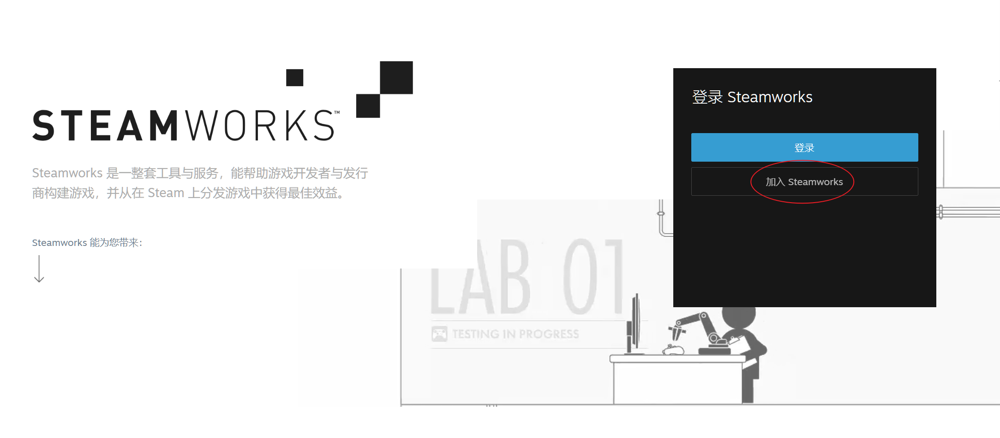
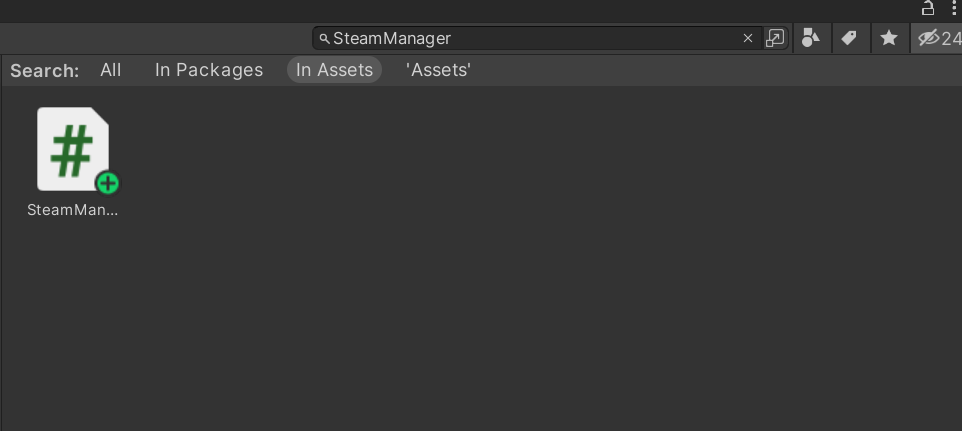
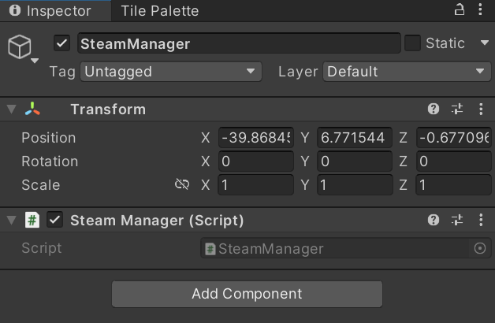
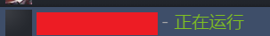

# Steam 上架流程（Unity 版）

作者的书：[《中国游戏风云》](https://book.douban.com/subject/36077734/) | [《游戏为什么好玩》](https://book.douban.com/subject/36347706/) | [《游戏化思维》](https://book.douban.com/subject/36210962/) | [《电子游戏商业史》](https://book.douban.com/subject/36394867/) | [《游戏机图鉴》](https://book.douban.com/subject/35894947/)

本文档的 Github 地址：https://github.com/superwyh/GameResources

## 注意事项

传统意义上有一些游戏的发售旺季，比如圣诞节假期、新年等，这个期间的游戏销量几乎是全年最高的时候，甚至有的游戏全年销售的一半在11到1月之间。等等，你是不是认为我的意思是，这是个最好的销售季？正好相反，我想表达的意思是，这可能反而不是个好的销售时间点，这个时间意味着大批热门游戏会一窝蜂的上线，包括大型3A游戏，和更为成熟和知名的独立游戏。类似的时间节点还有包括 E3、TGS 等大型游戏展会期间。除非你对你的游戏特别有信心，否则考虑避开这个时间点吧。

如果你是在 Steam 上架游戏的话，一定要提前看好有没有促销季，要避免刚刚上线没多久，就立刻出现促销季，至少要保证你上线两周内没有促销季。因为促销季里的游戏基本都是相对较老的热门大作，会和本来平台给你的曝光时间冲突，进而冲淡你的影响。同样，也要保证你游戏的上架时间不是促销季刚刚结束，这时候的玩家都有游戏玩，也没有足够的钱来买你的游戏。

开发者如果希望查阅 Steam 其他游戏的相关数据，可以通过以下两个网址：

https://steamspy.com/

https://steamdb.info/sales/

这两家网站都是通过爬虫来粗估的销售数据，和实际比有差距，但可以作为参考。

## 账号注册

注册地址为：https://partner.steamgames.com/

  

选择加入 Steamworks => 创建 Steam 账户。注意，建议专门注册一个 Steam 账号管理游戏，否则可能后期会有很多麻烦。

后续注册流程和一般账号注册区别不大，但要注意四点：

1. 在输入姓名时，使用中文拼音，并且是先名字后姓氏的格式，另外中间一定要用空格分开，否则后续步骤会出错。如果是公司注册，那么后缀加上 Co.,Ltd 。
2. 输入姓名的时候可能会提示“你输入的法定名称已在Steamworks上注册”，这里有两个解决方案，方法一是姓名中间加个空格，大部分情况下就不会再有提示了；如果方法不行，那么方法二是给客服发消息，告诉他虽然有重名，但这就是你的真实姓名，并且你之前没注册过账号。
3. 在注册过程中会让你填写一张纳税用的 W9 表格。其中有一个问题是“你有 Tin 吗？”在这里请选择“是”，然后输入中国的身份证号，这样你日后收入的税率会从 30% 降低到 10% 。
4. 多数开发者在注册审核时会被拒绝，原因是地址无效。事实上，解决这个问题的方法非常简单，只要把你的地址改成和身份证地址完全一样就可以了。因为审核人员看的是你的地址和你提供的法定材料的地址是否相同。也不用担心你的实际地址和身份证地址不相同的问题，这里只是审核的报税信息，而不是给你邮寄产品。如果是公司注册，对应的地址最好是公司的注册地址，否则也要提供一个证明。
5. 期间会让你支付100美元。每一款 Steam 游戏都需要支付100美元。要注意，作为独立游戏开发者，至少需要一张支持外币的信用卡，建议直接多办几张尝试一下（Steam 大部分卡都支持，但是其他平台不保证）。如果开发者条件允许的话，尽量办两张信用卡，一张信用卡是有银联标椎和 Visa/MasterCard/American Express 两种 Logo 的双币卡，一张是只有 Visa/MasterCard/American Express 一个 Logo 的卡。之所以需要这两种卡，是因为某些原因，在海外渠道可能会出现某一种卡不能用的情况，比如开发者未来可能会开发 Google Play 或 iOS 的游戏，而这两种卡同时有基本就可以保证大多数的支付情况都可以使用。

在完成注册后，需要等待一定的时间交由 Valve 的员工审核，如果是工作日提交的，最快当天就能获得反馈，比较慢的情况次日也能获得答复。答复内容会发到你的注册邮箱中，内容是让你提供身份证的正反面照片。直接回复邮件即可。完成这步后，需要等待的时间较长，一般至少需要2个以上工作日，最慢可能需要1到2周的时间。

## 创建游戏

本文没有后台截图，只用文字描述。因为按照 Steam 的隐私协议，后台的内容是不允许对外展示的。Steam 的后台在各个商店里做的算是比较好的，而且有全中文，所以不用担心搞不懂。

在注册完成后，会看到一个后台主页。如果你是第一次注册账号，就可以直接创建游戏，因为在注册过程中已经付过款了。如果你之前创建过其他游戏，那么就点击支付 Steam Direct 费付款。

创建游戏后，会获得一个提示，里面有一堆内容，大概形式如下：

```
Created package "XXX Developer Comp" with ID YYY
Created package "XXX for Beta Testing" with ID YYY
Created package "XXX" with ID YYY
Added auto-grant to publisher XXX
Created store item 'YYY'
Created store package for store item 'YYY'
```

建议开发者把这个存一下，方便之后使用。

这里要注意，Steam 商店后台有几个非常容易混淆的概念，分别为 Depots、Builds、Package。

* Depot 是 Steam 用来存储的仓库编号，每个编号都是唯一不可更改的。
* Builds 是你游戏的打包文件，每次更新游戏都要上传新的 Builds。
* Package 是由 Steam 平台，把这个版本的所有 Depots 和每个 Depots 对应的 Builds 打包交付给玩家的。

能看到尚未发行的应用里多了一行，那个就是你的游戏。

选择【查看清单】后，能看到完整的列表，列表有左右两排。开发者可以先不用管左边的内容，只需要看右边的清单，把每一项全部完成就可以。当所有清单都变成完成后，就可以发布游戏了。

后面注意讲解每一部分。

### 基本信息

点进去后会进入商店页管理页面，在这个页面能完成大部分的工作。

注意，商店页面和程序的包是分开审核的，一般是游戏开发后期先提交商店审核，然后等开发完再提交包的审核。注意 Steam 有个非常奇怪的特性，和其他所有商店都不同，那就是 Steam 只审核第一次提交的程序包，之后的包都不会再审核。而其他商店，尤其是移动平台的商店，每一次更新都要审核。Steam 这个特性保证了开发者的版本更新可以非常频繁，甚至是自由。

首先页面的第一部分是【基本信息】，这里游戏名称会给你默认填写创建时的名称，剩下内容按照自己需求填写即可。

第二部分【外部链接】、【社交媒体链接】、【搜索关键词】都是非强制填写的内容。外部链接和社交媒体链接填你自己的就可以，关键词按照需求填写，注意关键词不要其他产品的名字，否则很可能审核不通过。

第三部分是【支持平台】，最简单的填写办法是看类似的游戏，然后照着它的填写。

后面【发行日期】和【成人内容】可以先不用管。【玩家数】、【支持功能】、【类型】按照游戏开发的实际情况选择。

这里唯一一个比较复杂的内容是【标签】，会直接进入一个标签向导。按照实际情况选择即可，建议可以看一下你选择的分类里的游戏是不是真的符合你游戏的情况。注意，类型的选项是多选，可以沾边就选上。

**注意，大部分选项都是多选，千万不要少选了。**

在选完后，可以看到 Steam 给你提供了一些游戏的清单，你可以看一些是不是和你的游戏类型相符，如果不符可以再调整。  

最后的【客服联系信息】至少要填写一个，当然后期联系你最多的不是玩家，可能是各种视频账号和鉴赏家。

填完上面内容后，点击 Save。

然后，我们直接进入页面一开始的第二个标签【描述】。

### 描述

描述的第一部分是关于此游戏。在这里填写你关于游戏的介绍，有四点需要注意的：

1. 如果需要填写多语言的介绍，在文本框右上的下拉菜单里更改。
2. 要注意它给你强调的那句话：“您不能在此栏中加入其他网站的链接。请使用“基本信息”选项卡下的栏目或在您自己的 Steam 社区中张贴附加链接。” 千万不要在这里加入有链接的内容。
3. 如果要插入图片，使用本页面最后的上传自定义图片。插入图片的格式是 [img]{STEAM_APP_IMAGE}/example.jpg[/img] 。
4. **注意，商店页面可以针对不同语言上传不同版本，但是英语版本必须要有，不过英文版里可以写中文。**

之后的概述和介绍相似，只不过更短，限制到300词。

最后的三部分内容【评测】、【奖项】、【特别公告栏】，如果有就填写，没有就直接无视，点击 Save 保存后进入下一部分【评级】。 

### 评级

这里最麻烦的是这个巴西分级，你可以直接做一个调查问卷来获得，如果不做那么游戏就不会在巴西上架。当然如果你觉得不在巴西上架没事就可以不做。完成巴西的部分后， 剩下的分级内容如果开发者没有就直接不用考虑，点击最后的 Save 就可以。

### 抢先体验

如果你需要做抢先体验，也就EA，就填写这一部分，如果不需要就直接无视。

### 图像资产

这部分是我觉得最麻烦的一部分，因为需要做很多图。下面这个表格是所有需要的的图：

Steam 提供了一个 Photoshop 的模板 ：https://partner.steamgames.com/public/marketing/steam_game_templates_2021.zip


| 图像用途          | 图像尺寸                        | 设计                                                                                                                                                                                                                                                                                                    | 用途                                                                     |
| ------------- | --------------------------- | ----------------------------------------------------------------------------------------------------------------------------------------------------------------------------------------------------------------------------------------------------------------------------------------------------- | ---------------------------------------------------------------------- |
| 形象图片          | 460px 宽 x 215px 高           | 此图片应着重强调您产品的品牌元素。为达到最佳效果，请使用与任何零售包装或营销相同的艺术作品，并确保徽标清晰可见。                                                                                                                                                                                                                                              | 图片将出现于您商店页面顶部、“为您推荐”栏目中、Steam 客户端里顾客库内的“网格视图”中、大屏幕模式下的浏览视图中以及适用的每日特惠中。 |
| 小宣传图          | 231px 宽 x 87px 高            | 这些是小尺寸图片，因此在最小尺寸下也应使徽标清晰可见。                                                                                                                                                                                                                                                                           | 这些用于 Steam 上所有的列表中，如搜索结果、热销商品、新品等等。                                    |
| 主宣传图          | 616px 宽 x 353px 高           | 应为产品的营销而设计。为获得最佳效果，请使用用于零售包装或营销的关键艺术元素和徽标。请勿包含引语、评测分数或奖项。                                                                                                                                                                                                                                             | 出现在首页顶部。                                                               |
| 竖向宣传图         | 374px 宽 x 448px 高           | 这是一种竖向图像资产，为您游戏的营销而设计。为获得最佳效果，请使用用于零售包装或营销的关键艺术元素和徽标。请勿包含引语、评测分数或奖项。                                                                                                                                                                                                                                  | 可能于季节性特卖期间出现在首页顶部，以及其他新的特卖页面上。                                         |
| 页面背景          | 1438px 宽 x 810px 高          | 背景图片只起烘托作用，应避免喧宾夺主。因此请尝试避免高对比度图片或带有大量文本的图片。您上传的图片会被自动套用模版，使图片略带蓝色，边缘淡化。如果您不上传自己的图片，我们将自动使用最后一张截图生成背景图片。                                                                                                                                                                                               | 此图片将会用作您的商店页面背景。                                                       |
| 截图            | 1280 x 720 或 1920 x 1080 最佳 | 选择可以清楚地表明游戏进行过程中玩家的视角和游戏玩法的截图。选择可以清楚地传达您游戏类型信息的截图。显示 HUD 元素通常有助于快速向玩家传达此类信息。避免菜单画面。如果您的游戏含有儿童不宜的内容，您应该上传并标记至少四张适合所有年龄段的截图。适合的截图不应包括血腥、暴力或挑逗性内容。这些截图可能会在您的商店页之外——如主页上——显示。如果您没有提供足够的截图并恰当标记，即使其他条件符合，您的游戏也许无法在这些地方显示。要上传截图的本地化版本，将替代版本拖放至下方截图旁的指定区域。可使用语言名称作为后缀，向 UI 提示此缩略图应使用的语言（如：foo_japanese.jpg）。 | 必须提供至少 5 张。                                                            |
| 库宣传图          | 600px 宽 x 900px 高           | 宣传图应以图片为中心，并为用户提供一些游戏体验感。请使用用于零售包装或营销的关键艺术元素，以及您游戏的名称，最好使用与在零售包装或营销材料上所印制的相同徽标或标题。除了您应用程序的标题外，请勿包含引语、营销文案或其他文本。艺术作品应描绘您产品中的重要内容。徽标在背景中应易于识别。                                                                                                                                                          | 此图片主要用于库概览及收藏视图中                                                       |
| 库主页图片         | 3840px 宽 x 1240px 高         | 此图片应具有丰富的视觉效果，且易于辨认。为获得最佳效果，请使用用于零售包装或营销的关键艺术元素。请勿包含引语或其他文本。模板中心是大小为 860px x 380px 的“安全区域”。此区域在 Steam 客户端窗口进行缩放和调整大小时不会被裁剪。艺术作品应横跨整个模板，但关键内容应位于安全区域内。例如：主要角色的脸部应完全位于安全区域内，否则有被裁剪的可能。                                                                                                                  | 在用户库中此产品的详情页面显示。                                                       |
| 库徽标           | 1280px 宽 x 720px 高          | 为达到最佳效果，请使用用于任何零售包装或营销的徽标。请确保徽标在主页图片背景中易于识别，有时候投影效果会有帮助。PNG 图片背景应透明。                                                                                                                                                                                                                                  | 在用户库中此产品的详情页面显示，叠加于主页图片之上。                                             |
| Steam 直播（测试版） | 两张图片，均为 155px 宽 ，337px 高    | 实况直播会显示于商店页面的宣传片与截图栏上方。直播视频的宽度小于商店页面的宽度，处于居中位置，两侧是可自定义的艺术作品空间。要用您自己的艺术作品进行自定义，请将图片拖放至此页面顶部，从下拉列表中选择“实况直播面板”，并选择右/左方向。                                                                                                                                                                                 |                                                                        |


这里 Steam 提供了很方便的功能，因为图片尺寸不同，所以只要在下方上传图片，Steam 会自动把图片放在合适的位置上。其中截图上传完成英文版以后，可以在后面上传本地化的版本。在上传库资产以后，记得使用【放置工具】调整 Logo 的位置：

### 宣传片

宣传片是必须的，Steam 可以上传多个宣传片，所以尽量多做几个。Steam 在这里有个很奇怪的地方，宣传片并没有算作商店部分的清单里，而是被放在了生成版本的分类里。此外，Steam 有一个特殊的说明：“您的第一个视频应该尽快进入游戏或操作。”所以如果只想做一个宣传片，那就做一段游戏的录屏。

## 社区

【社区】部分的主要工作也是上传图片。

### 社区图标

这一个部分最主要的是社区图标，其余都是非必须的。看需要填写即可。

### 客户端图标

客户端图标其实只需要上传一张 32px x 32px 的 ico 图片，剩下的格式 Steam 会自动生成。

这里涉及到图片格式的转换，推荐这个网站：https://convertio.co/zh/ico-converter/

## 特别设置和本地化

后面还有两个标签是特别设置和本地化，需要开发者根据自己的需求设置，但都不是强制的。

## 成人内容设置

完成这一步以后，我们回到清单页面，可以看到基本已经完成了全部清单内容。

我们下一部就是成人内容的设置。这里有一个非常容易出问题的地方，首先问题其实很简单，除非你做的就是成人游戏，否则选不就可以了。 但选完后一定注意，右边还有一个发布的选择，必须再点一次这个才算完成问卷。 

### 发行日期

最后回到清单页面，在右上角能看到发行日期，在这里设置即可。这一部完成后，就可以看到清单已经完成了。然后回到游戏的主界面，也就是有清单的那个界面，可以看到最上方已经出现了【清单完成】。如果开发者觉得内容没问题了，那么就提交审核。

审核通过并不意味着就上架了，开发者可以手动控制是否上架。所以不用担心东西没写好就直接上架，也务必记得审核通过后还要操作一下。商店的审核时间比较短，一般2到3天，但是包的审核可能很慢，一般是3到5天之间，所以要预留好时间。此外，游戏至少要在商店页面公开两周后才能发售。如果是第一次开通 Steam 的开发者账号，那需要在付款后30天才能上传游戏。

## 接入 Steamworks.NET

Steamworks 是用来接入 Steam 的 SDK，源自 Steam 官方。但是是使用 C++ 开发的，在 Unity 中也可以使用，但功能的实现比较复杂。所以现在大部分使用的都是开源的 Steamworks.NET ，这是使用 C# 开发的一套框架。在 Unity 里使用非常方便。 

Steamworks.Net 的下载地址：https://github.com/rlabrecque/Steamworks.NET/releases/

建议直接下载最新版的 .unitypackage 文件，方便在 Unity 里安装。

安装完成后，在项目的根目录下能看到 steam_appid.txt 文件，注意是比 Assets 高一级，可以右键 Show in explorer 打开文件，然后去上一级找到 steam_appid.txt。打开后，把里面的 480 改成你在 Steam 上游戏的ID，这个 ID 是你在 Steam 商店里，游戏名字右边的那个 ID 。

**注意，要以 ASCII 或者 UTF-8 格式保存这个文件！！！**

然后搜索 SteamManager ，找到这个文件，如下：

  

打开文件，在里面搜索 AppId_t.Invalid 能看到如下内容：

```csharp
if (SteamAPI.RestartAppIfNecessary(AppId_t.Invalid)) {
    Debug.Log("[Steamworks.NET] Shutting down because RestartAppIfNecessary returned true. Steam will restart the application.");

    Application.Quit();
    return;
}
```

把 AppId_t.Invalid 改成 (AppId_t)480 ，其中 480 是你的 ID。

创建一个空物体，把 SteamManager 脚本挂上去。

  

然后确保两件事情：

1. Steam 已经启动，并且能正常使用（你懂得），以及 Steam 登录的是和你的开发者同一个账号（确认这个账号的仓库里有你正在开发的游戏）。
2. Unity 和 Steam 在同一台电脑的同一个系统下。

然后在 Unity 里运行程序。这时候进入 Steam，应该可以看在这个游戏正在运行中。

 

**要特别注意，你在 Steam 里点停止游戏，会直接把 Unity 给关闭了！！！**

这一步以后，就可以完成游戏的提交了。此外还可以在游戏里加入云文档和成就系统，具体看官方的案例即可。

使用的开发文档在这里：https://steamworks.github.io/installation/

如果有不懂的可以看官方提供的案例：https://github.com/rlabrecque/Steamworks.NET-Example#steamworksnet-example


## 定价

在首页最上面【商店程序包、定价与发行日期】的部分可以设置定价，定价设置方式是开发者选定一个美元价格，之后自动生成其他货币的定价。之后玩家可以根据需要调整每种货币的价格。但是不能差距太大，因为之后会有 Steam 对价格的审核，有可能会不通过。

## 提交包

提交包的地方在首页的【编辑 Steamworks 设置】里。

首先我们在 SteamPipe 里可以看到管理 Depot，在这里每一个 Depot 可以对应一个操作系统或者一个语言的版本。开发者可以根据自己的实际需求创建多个。记得最后一定要点保存。

然后进去安装 => 通用安装 => 启动选项里，设置启动用的 .exe 文件名和对应的操作系统。

最后到 SteamPipe => 生成版本里，找到对应的 Depot，上传对应的包即可。注意，包要打包成 .zip 的文件

如果你的包小于 2G，可以直接在浏览器上传。我最推荐这种方法，因为非常省事。